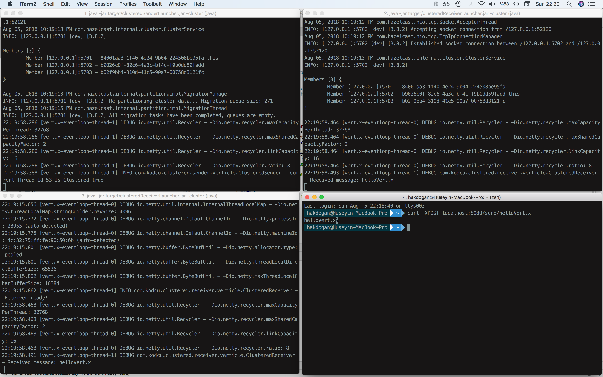

# Clustered Sender

This example shows the use of `broadcasting messaging` in the `clustered environment`. The messages you send with the `HTTP Post` requests over `the http://localhost:8080/send/:message` are forwarded to the all registered receiver.

```java
/**
     *
     * @param routingContext
     */
    private void sendMessage(RoutingContext routingContext){
        final EventBus eventBus = vertx.eventBus();
        final String message = routingContext.request().getParam(PATH_PARAM);

        eventBus.publish(ADDRESS, message);
        log.info("Current Thread Id {} Is Clustered {} ", Thread.currentThread().getId(), vertx.isClustered());
        routingContext.response().end(message);
    }
    
```

## Requirements
* JDK 8 or later
* Maven 3.0.0 or later

## To compile
```
mvn celan install
```

## To run
```
java -jar target/clusteredSenderLauncher.jar -cluster
#For multiple instances java -jar target/clusteredSenderLauncher.jar -cluster -instances 2

```
Or

```
sh run.sh
```



## Relevant article is
[How to Run a Vert.x Cluster With Broadcasting Messaging](https://medium.com/@hakdogan/how-to-run-a-vert-x-cluster-with-broadcasting-messaging-fc79ff113c9c)
